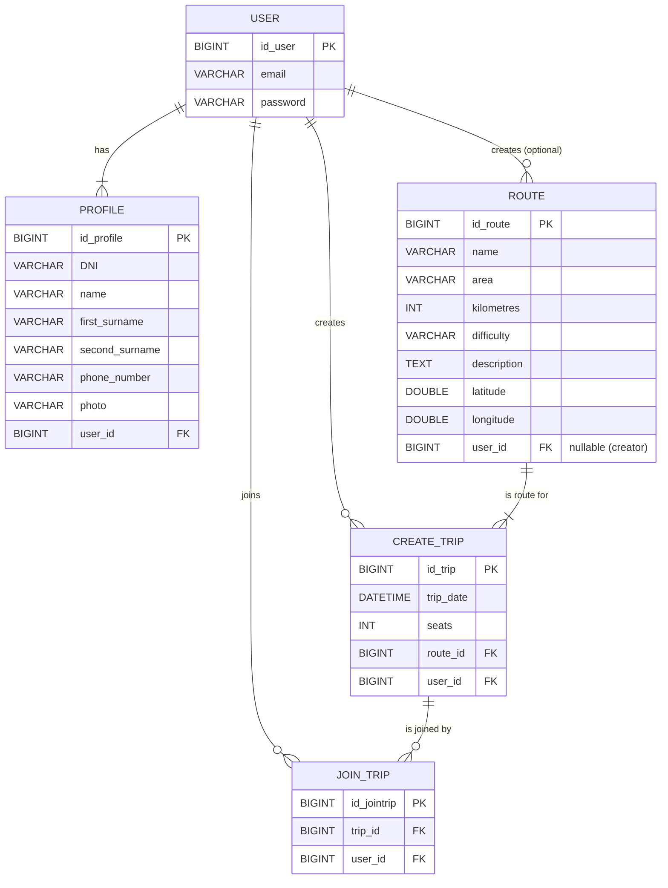

# Asturias Ruta & Ride – Backend

Backend desarrollado con **Spring Boot** para la aplicación **Asturias Ruta & Ride**, diseñada para explorar rutas de senderismo en Asturias y gestionar un sistema seguro de registro, login y verificación por correo.

Este proyecto forma parte del Bootcamp **Full-Stack Web Developer** y simula un entorno real de desarrollo profesional.


---


##  Tecnologías utilizadas

| Tecnología | Uso |
|------------|------|
| **Java 21** | Lenguaje principal |
| **Spring Boot 3.5.7** | Framework backend |
| Spring Data JPA | Persistencia ORM |
| Spring Security + JWT | Seguridad y autenticación |
| MySQL (Docker) | Base de datos principal |
| H2 | BD para desarrollo rápido |
| JavaMailSender | Envío de correos |
| Maven | Gestión de dependencias |
| Docker & Docker Compose | Contenedores |


---


##  Arquitectura del proyecto

El backend sigue una estructura modular en capas:

```
src/main/java/dev.milca.ruta_ride
│
├── auth/ # Registro, login, verificación y JWT
├── route/ # Gestión de rutas (entidad, servicio y controlador)
├── user/ # Usuario, token de verificación y servicio email
├── spring_security/ # Configuración de seguridad y CORS
└── common/ # Excepciones y utilidades comunes
```

---


###  Diagrama ER (Entidad–Relación)





Nota: El diagrama refleja la arquitectura planificada del proyecto. En esta primera versión se han implementado los módulos de Usuarios (registro/login/verificación) y Rutas.

---

## Modelo de datos

### **Users**
- Campos: id, name, email (único), password, phone, profileImage  
- `isVerified`: controla el acceso tras verificación del correo

### **VerificationToken**
- Token único 1:1 con un usuario  
- `expiryDate` → caduca a las 24h

### **Routes**
- id, name, area, kilometres, difficulty, image, description, latitude, longitude

---

## Endpoints principales

### Autenticación (`/api/v1/auth`)

| Método | Endpoint | Descripción |
|--------|-----------|--------------|
| POST | `/register` | Registra usuario y envía correo de verificación |
| GET | `/verify?token=` | Activa cuenta mediante token |
| POST | `/login` | Devuelve JWT (solo si el usuario está verificado) |

### Rutas (`/api/v1/routes`)

| Método | Endpoint | Descripción |
|--------|-----------|--------------|
| GET | `/` | Lista todas las rutas |
| GET | `/{id}` | Devuelve el detalle de una ruta |

---

## Seguridad

✔ JWT integrado con filtros personalizados  
✔ Contraseñas cifradas con BCrypt  
✔ Rutas protegidas por autenticación  
✔ CORS configurado para conectar con frontend (`http://localhost:5173`)  
✔ Acceso restringido hasta verificar correo  

---

## Tests

Se han implementado tests unitarios (servicios, controladores, repositorios y entidades).
Se cubrirán tests de integración en la siguiente iteración del proyecto.

✅ Route: Controller, Service, Repository, DTO, Entity  
✅ User: Entity & Repository  
☑️ Próximos: Auth + Service email (mocking)

> Cobertura actual: ~**40%** → Objetivo **70%** (bootcamp)

Ejecutar tests:

```bash
./mvnw test
```

---

## Configuración y ejecución

### Requisitos previos

- Java 21
- Maven
- (Opcional) Docker + Docker Compose para usar MySQL
- Credenciales SMTP para envío de emails

---

### Opción A: Ejecutar con MySQL + Docker Compose (recomendado)

1. Iniciar base de datos:

```bash
docker compose up -d
```

2. Iniciar base de datos:

```bash
./mvnw spring-boot:run -Dspring-boot.run.profiles=mysql
```

Opción B: Ejecutar con H2 (sin base de datos instalada)

```bash
./mvnw spring-boot:run -Dspring-boot.run.profiles=h2
```

Consola H2:
http://localhost:8080/h2-console

---

## Variables de entorno

Las credenciales sensibles deben configurarse como **variables de entorno**.

Ejemplo:

```bash
SPRING_MAIL_USERNAME=<your_smtp_user>
SPRING_MAIL_PASSWORD=<your_smtp_password>
JWT_SECRET=<your_jwt_secret>
```
---

## 📽️ Demo & Presentación
> 🔗 [**Presentación oficial del proyecto (Canva)](https://www.canva.com/design/DAG33nGWu-M/vWakPaQiWbtmhJTmKPBihA/edit?utm_content=DAG33nGWu-M&utm_campaign=designshare&utm_medium=link2&utm_source=sharebutton)  

A continuación se muestran capturas representativas del MVP funcionando:

| Pantalla | Vista |
|----------|--------|
| Home |  |
| Listado de Rutas |  |
| Detalle de Ruta |  |
| Register |  |
| Login | 

---

## 🚀 Estado del Proyecto

**Fase actual:** MVP completado  
El backend cumple con los objetivos de la fase actual del Bootcamp:

| Funcionalidad | Estado |
|----------------|--------|
| Registro con verificación por email | ✅ Implementado |
| Login con JWT y seguridad | ✅ Implementado |
| Listado y detalle de rutas | ✅ Implementado |
| API conectada con frontend | ✅ Activo |
| Dockerización del entorno | ✅ Lista |


---

## 🧭 Plan de Futuras Mejoras

Estas son las funcionalidades previstas para la siguiente fase de evolución del proyecto:

- **Carpooling / Viajes compartidos:** permitir a usuarios crear y unirse a viajes para acceder a rutas.
- **Favoritos de usuario:** guardar rutas como favoritas para acceder rápidamente.
- **Perfiles más completos:** edición de perfil, foto de usuario y estadísticas personales.
- **CRUD completo de rutas:** incluir creación, edición y eliminación (solo para roles con permiso).
- **Recuperación de contraseña:** con email seguro y expiración de enlace.
- **Roles y permisos:** separar privilegios para usuario, admin y conductor.
- **Logs del sistema y métricas de uso:** registro de eventos (login, fallos de email, tráfico) y métricas básicas del API.
- **Despliegue en la nube:** Backend en Render/Railway y Frontend en Vercel.
- **Tests de integración y E2E:** ampliar la cobertura actual para validar flujos completos del sistema.

---

